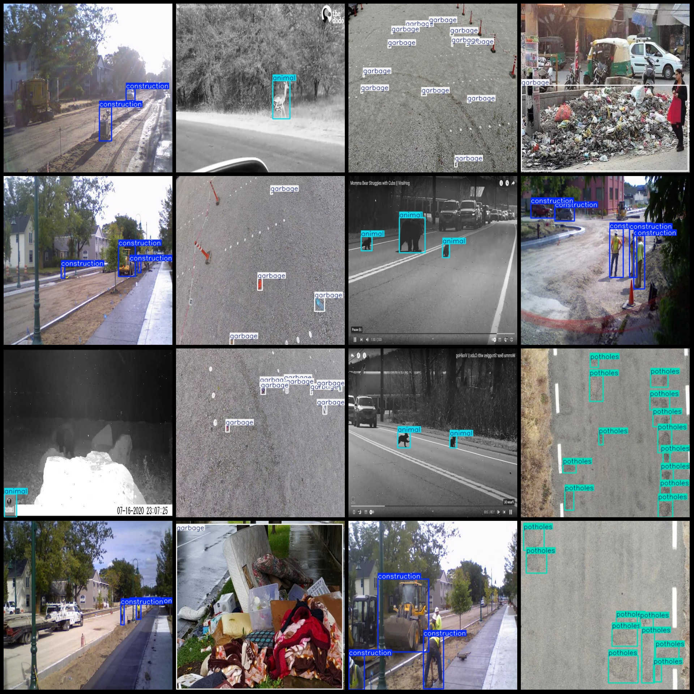
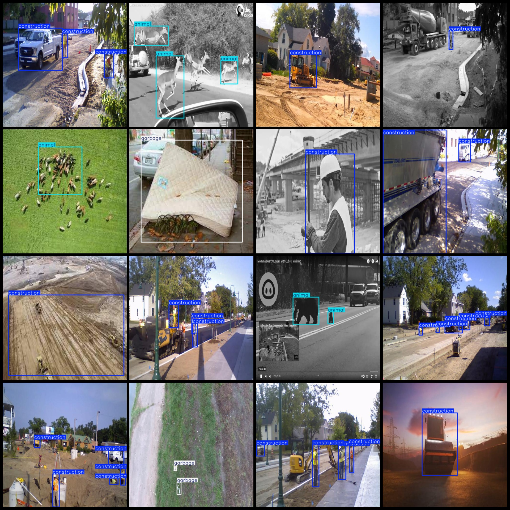

# Smart Traffic Road Paving Cracks Car Accidents Waste Animals Detection Dataset VOC+YOLO Format 4600 Images with 5 Categories

Dataset format: Pascal VOC format + YOLO format (without split path in the txt file, only include jpg images along with corresponding VOC format xml files and YOLO format txt files)
Number of images (jpg file count): 4600
Number of annotations (xml file count): 4600
Number of annotations (txt file count): 4600
Number of annotation categories: 5
Dataset has enhancements: Some enhanced images
Annotation category names (note that the order of categories in the YOLO format may not match this, but refer to the "labels" folder's "classes.txt" for reference): ["animal", "car_accident", "construction", "garbage", "potholes"]
Number of boxes per category:
- animal (animals) = 1832
- car_accident (accidents) = 701
- construction (construction) = 3717
- garbage (garbage) = 4798
- potholes (potholes) = 417
Total number of boxes: 11465
Image resolution: 512x512
Annotation tool used: labelImg
Annotation rules: Draw bounding boxes for each category
Important notes: None
Special declaration: This dataset does not guarantee the accuracy of the trained models or weight files.
Image preview:

## Images

Here is a pay link on Stripe ( https://buy.stripe.com/3cs8yP7sY87d0vu9AB ). Please contact me lonlonago@foxmail.com after funding $89, and I will send you a complete data files , thank you!

